# Rural AI Doctor

Rural AI Doctor is an AI-assisted healthcare platform built for rural and low-resource clinical environments. It combines conversational triage, multi-step diagnosis support, voice and image workflows, retrieval-augmented medical knowledge, auditability, and operational tooling in a full-stack web application.

The codebase is split into a FastAPI backend and a Next.js frontend, with infrastructure choices aimed at practical deployment: PostgreSQL with `pgvector`, structured logging, rate limiting, health checks, observability hooks, and modular API services.

## Highlights

- AI chat and symptom triage workflows for guided first-pass assessment
- Multi-agent diagnosis support with treatment planning and report generation
- Voice consultation features for transcription, speech output, and spoken diagnosis flows
- Vision workflows for image and X-ray analysis
- RAG workspace for searching indexed medical documents and knowledge sources
- Follow-up planning, appointment scheduling, export tooling, and clinical ops screens
- Medication safety checks, audit trails, and clinician override feedback paths
- Offline-sync oriented APIs for intermittent-connectivity scenarios

## Screenshots

### Welcome + Feature Access

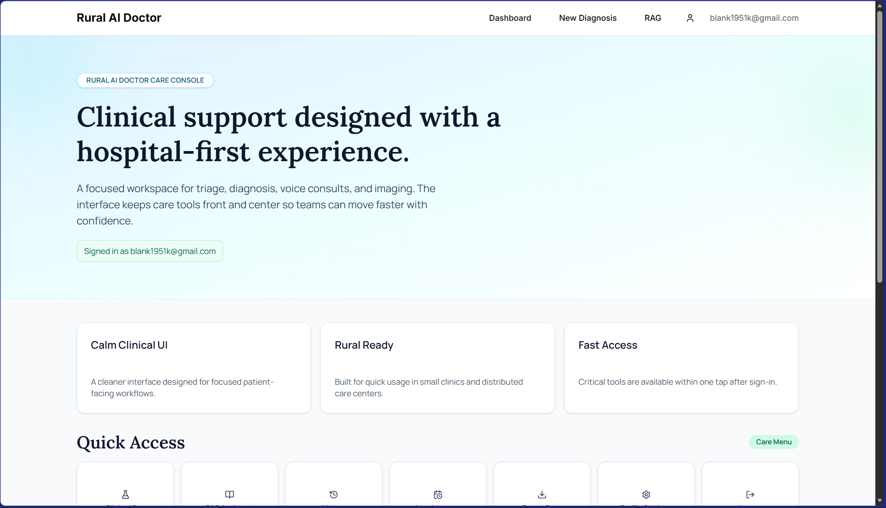

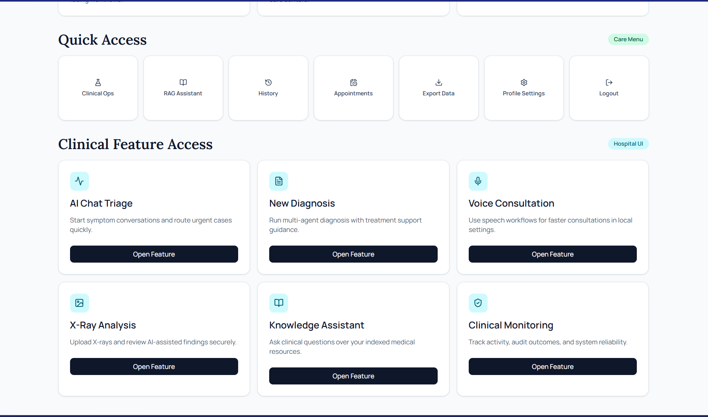

### User Dashboard + Diagnosis

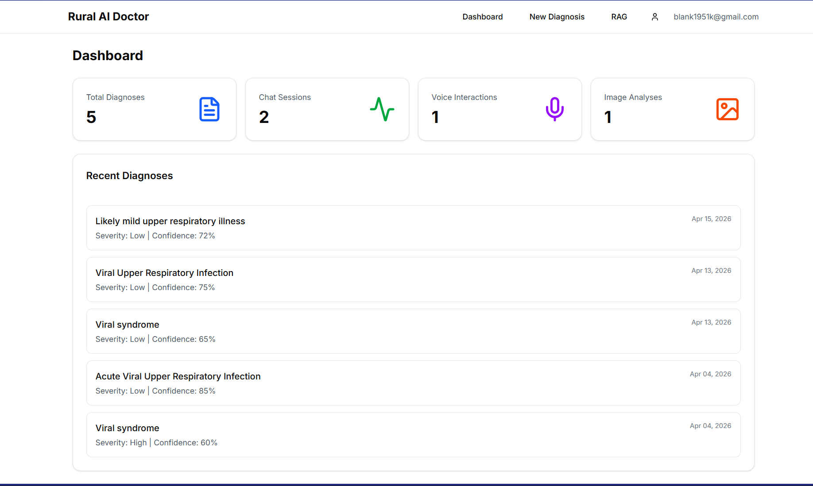

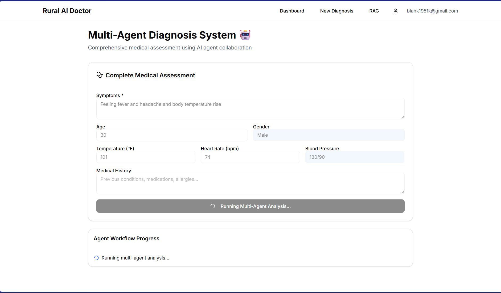

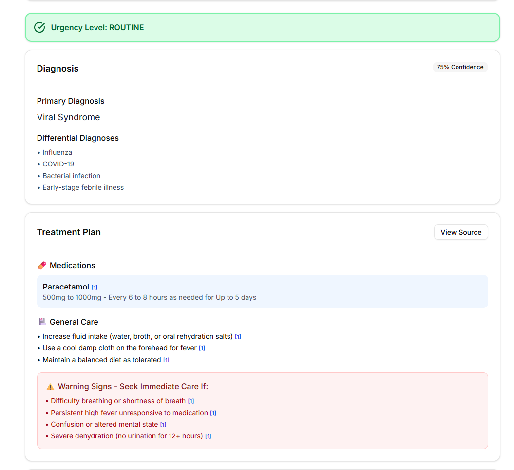

### Knowledge / RAG Assistant

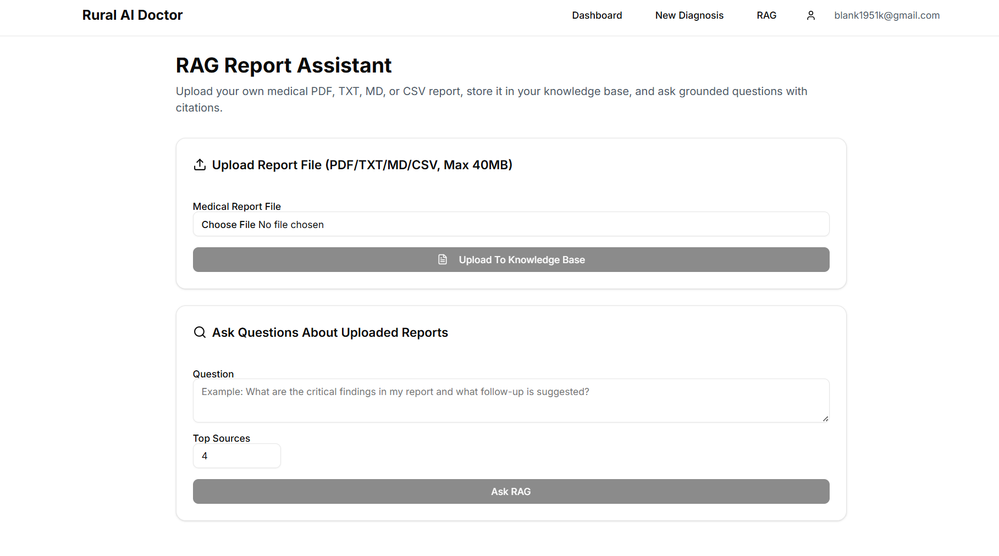

### Vision / X-Ray Analysis

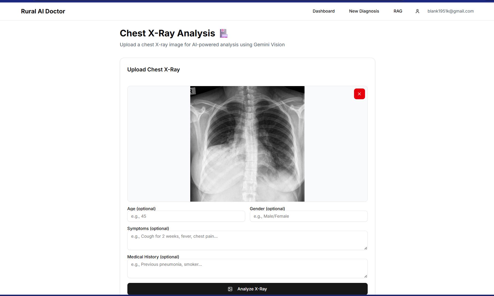

### Clinical Ops Console

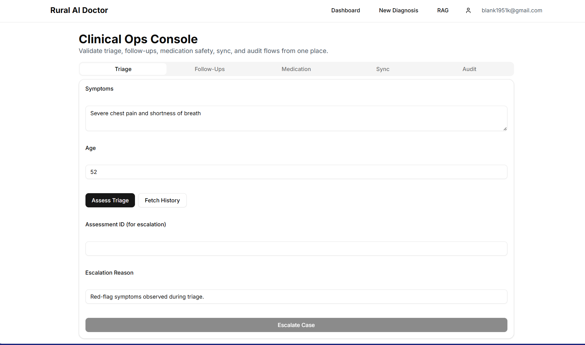

### Admin Console + Governance

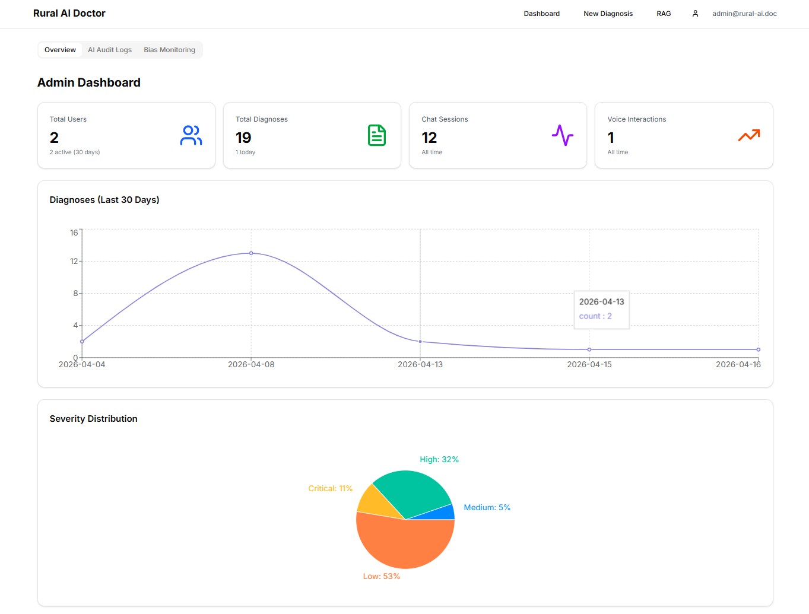

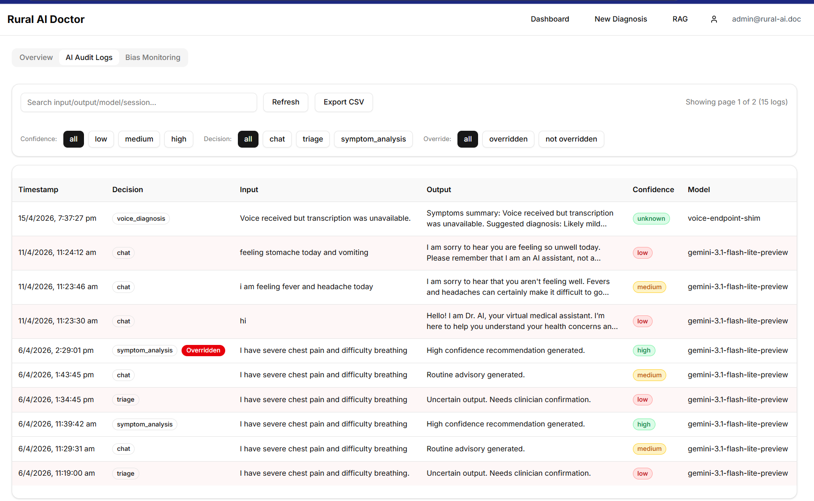

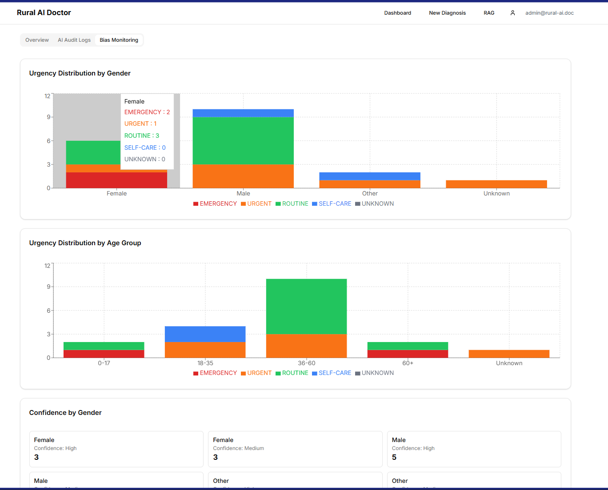

## Tech Stack

| Layer | Stack |
| --- | --- |
| Frontend | Next.js 16, React 19, TypeScript, Tailwind CSS, Radix UI, Zustand, React Query |
| Backend | FastAPI, SQLAlchemy, Pydantic Settings, Uvicorn, Gunicorn |
| Data | PostgreSQL, `pgvector`, Alembic, Redis-compatible cache configuration |
| AI | Google Gemini, LangChain, LangGraph, LangSmith |
| Media | OpenCV, Pillow, PyMuPDF, pydub, gTTS, ElevenLabs |
| Observability | Prometheus instrumentation, structured logging, Sentry |
| Testing | Pytest, Jest, Testing Library |

## Core Product Areas

### Clinical Decision Support

- Symptom intake and AI-assisted triage
- Escalation handling for urgent or emergency cases
- Diagnosis support with treatment and emergency action nodes

### Rural-Care Workflow Support

- Follow-up scheduling and status tracking
- Appointment management
- Offline sync endpoints for delayed connectivity environments

### Multimodal Care Interfaces

- Voice consultation and transcription endpoints
- X-ray and image analysis workflows
- Knowledge retrieval over uploaded or indexed medical content

### Governance and Operations

- Audit logs for AI decisions
- Feedback and override capture for clinician review
- Admin, backup, export, and reporting endpoints

## Architecture

### Frontend

The frontend lives in [`frontend`](./frontend) and provides the clinical workspace. The main application includes routes for chat, diagnosis, voice consultation, X-ray analysis, RAG, dashboard history, appointments, export, admin, and clinical ops.

Key frontend areas:

- `src/app`: App Router pages and layouts
- `src/components`: feature-specific UI modules
- `src/lib/api`: backend client helpers and API wrappers
- `src/lib/auth`: authentication context
- `src/store`: lightweight state management

### Backend

The backend lives in [`backend`](./backend) and exposes a versioned REST API under `/api/v1`.

Key backend areas:

- `app/api/v1/endpoints`: route handlers by feature area
- `app/services`: business logic for AI, voice, vision, RAG, export, backup, email, and notifications
- `app/db`: SQLAlchemy engine, session, and models
- `app/schemas`: request and response contracts
- `alembic`: database migrations
- `tests`: backend API and workflow coverage

## API Surface

The backend currently includes routers for:

- `auth`
- `users`
- `reports`
- `admin`
- `export`
- `appointments`
- `backup`
- `rag`
- `chat`
- `vision`
- `agents`
- `voice`
- `triage`
- `followups`
- `medications`
- `sync`
- `audit`
- `health`

When `DEBUG=true`, interactive docs are available at `/docs` and `/redoc`.

## Local Development

### Prerequisites

- Python 3.11+
- Node.js 20+
- PostgreSQL 16 with `pgvector`
- npm

### 1. Start the database

From the `backend` folder, a local Docker setup is available for PostgreSQL:

```bash
cd backend
docker-compose up -d
```

This exposes PostgreSQL on `localhost:5434` with a default database named `rural_ai_doctor`.

### 2. Configure backend environment

Create a local environment file from the example:

```bash
cd backend
copy .env.example .env
```

Update values such as:

- `DATABASE_URL`
- `SECRET_KEY`
- `GOOGLE_API_KEY`
- `OPENFDA_API_KEY`
- `LANGCHAIN_API_KEY`
- `SENTRY_DSN` if you want error tracking locally

### 3. Install backend dependencies

```bash
cd backend
python -m venv .venv
.venv\Scripts\activate
pip install -r requirements.txt
```

### 4. Initialize the database

You can either run migrations:

```bash
cd backend
alembic upgrade head
```

Or use the project initialization script, which syncs schema, enables `pgvector`, and seeds a default admin account for local use:

```bash
cd backend
python scripts/init_db.py
```

### 5. Run the backend API

```bash
cd backend
uvicorn app.main:app --reload
```

The API will be available at `http://127.0.0.1:8000`.

### 6. Install and run the frontend

```bash
cd frontend
npm install
npm run dev
```

The frontend will be available at `http://localhost:3000`.

By default, the frontend resolves the API base URL to `http://127.0.0.1:8000/api/v1` in local development. You can override this with `NEXT_PUBLIC_API_URL`.

## Testing

### Backend

```bash
cd backend
pytest
```

Workflow coverage includes clinical triage, follow-up transitions, medication safety, sync conflict handling, and audit feedback paths.

### Frontend

```bash
cd frontend
npm test
```

Additional scripts:

- `npm run build`
- `npm run test:coverage`
- `npm run test:watch`

## Project Structure

```text
Rural_AI_Doctor/
|-- backend/
|   |-- app/
|   |   |-- api/
|   |   |-- core/
|   |   |-- db/
|   |   |-- schemas/
|   |   `-- services/
|   |-- alembic/
|   |-- scripts/
|   `-- tests/
|-- frontend/
|   |-- src/
|   |   |-- app/
|   |   |-- components/
|   |   |-- hooks/
|   |   |-- lib/
|   |   `-- store/
|   `-- public/
|-- docs/
`-- scripts/
```

## Deployment Notes

- The frontend includes `vercel.json`, indicating Vercel-oriented deployment.
- The backend includes `Procfile`, `runtime.txt`, and production middleware suitable for Render-style deployment.
- Health endpoints are exposed at `/health` and `/health/detailed`.
- Metrics are exposed through Prometheus instrumentation.

## Safety Note

This project is a clinical decision-support application, not a replacement for licensed medical judgment. Any real-world deployment should include clinical validation, privacy/security review, and appropriate regulatory and operational safeguards.

## Resume / Portfolio Value

This project demonstrates:

- full-stack product engineering across frontend, backend, and data layers
- production-style API design and observability
- applied AI integration beyond simple chat interfaces
- healthcare workflow thinking, including auditability and safety controls
- multimodal UX design spanning text, voice, documents, and imaging
